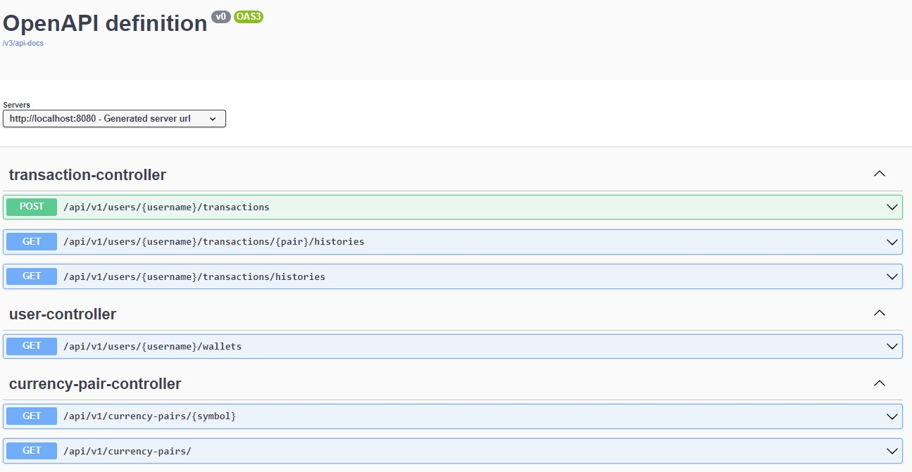
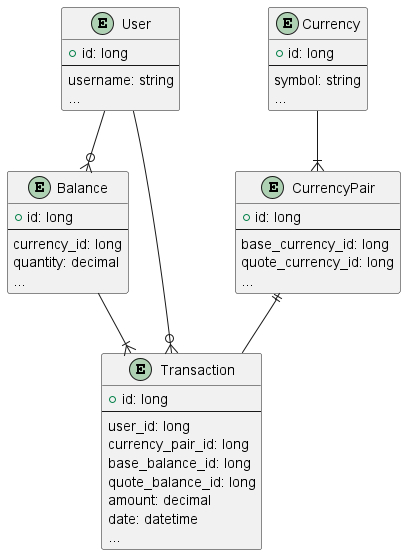

# cryptoapp


## Prerequisites
Java >= 17 <br />
Maven

## H2 Console
URL: http://localhost:8080/h2-console <br />
Username: sa <br />
Password: 

## Assumptions
- User has already authenticated and authorised to access the APIs
- User's initial wallet balance 50,000 USDT in DB record.
- Only support Ethereum - ETHUSDT and Bitcoin - BTCUSDT pairs of crypto
  trading.
- Each user has one 1 wallet to reduce the complexity

## Initial Data
The application is preloaded with some initial data.  <br />
The default user data is loaded from the file `src/main/resources/default-user.json`.
```agsl
{
  "username": "admin",
  "currency": "USDT",
  "amount": 50000
}
```
The currencies data is loaded on startup of the application. <br />
From the file `src/main/resources/pairs-definition.json`
```agsl
BTC
ETH
USDT
```

## Build and run
```agsl
mvn clean install

mvn spring-boot:run
```

You should see the following message in the console
```agsl
Tomcat started on port(s): 8080 (http) with context path ''
Started CryptoappApplication in 4.382 seconds (process running for 4.731)
Aggregate Trading pairs: [TradingPair( XXX ... ) // For scheduler price
```

## API Documentation
The API documentation is available at the following URL: http://localhost:8080/swagger-ui/index.html



## Database Schema
The database schema is available the root folder, there are 2 files:
1. `db-schema.puml` is the database schema by plantuml
2. `db-schema-image.png` is the database schema by image




## API Endpoints and Testcase

### 1. After the application running, you can use "/api/v1/users/admin/wallets" endpoint to verify the default user
API Endpoint: 
```
/api/v1/users/{username}/wallets
```

For username: admin
```
curl --location 'localhost:8080/api/v1/users/admin/wallets'
```
The data should be
```agsl
[
    {
        "symbol": "USDT",
        "balance": 50000.00
    }
]
```

### 2. Verify the currency pairs data and price from Binance or Huobi (10s interval)

2.1. Get all currency pairs
```
curl --location 'localhost:8080/api/v1/currency-pairs/'
```
The data should be kind of
```agsl
[
    {
        "id": 1,
        "symbol": "ETHUSDT",
        "bidPrice": 2093.77,
        "askPrice": 2093.75
    },
    {
        "id": 2,
        "symbol": "BTCUSDT",
        "bidPrice": 29897.57,
        "askPrice": 29894.55
    }
]
```

2.2. Get currency pair by symbol (e.g. ETHUSDT or BTCUSDT)
```agsl
curl --location 'localhost:8080/api/v1/currency-pairs/ETHUSDT'
```
The data should be kind of
```agsl
{
    "id": 1,
    "symbol": "ETHUSDT",
    "bidPrice": 2094.10,
    "askPrice": 2093.75
}
```

**After this step, we have a default user and currency pairs with prices. Now we can do some transactions**
### 3. Do a transaction with BUY ETHUSDT
```agsl
curl --location 'localhost:8080/api/v1/users/admin/transactions' \
--header 'Content-Type: application/json' \
--data '{
    "symbol": "BTCUSDT",
    "quantity": "1",
    "type": "SELL"
}'
```
Payload explanation:
```agsl
{
    "symbol": "BTCUSDT", // currency pair, should be BTCUSDT or ETHUSDT
    "quantity": "1", // quantity of the currency pair, quantity 1 means 1 BTC or 1 ETH
    "type": "BUY" // transaction type, should be BUY or SELL
}
```

For instance, if we want to buy 3 ETH with 1 BTC, we can do
```agsl
// BUY 1 BTC
curl --location 'localhost:8080/api/v1/users/admin/transactions' \
--header 'Content-Type: application/json' \
--data '{
    "symbol": "BTCUSDT",
    "quantity": "1",
    "type": "BUY"
}'

// BUY 2 ETH
curl --location 'localhost:8080/api/v1/users/admin/transactions' \
--header 'Content-Type: application/json' \
--data '{
    "symbol": "ETHUSDT",
    "quantity": "2",
    "type": "BUY"
}'

// BUY 1 ETH
curl --location 'localhost:8080/api/v1/users/admin/transactions' \
--header 'Content-Type: application/json' \
--data '{
    "symbol": "ETHUSDT",
    "quantity": "1",
    "type": "BUY"
}'
```

You can prepare your testcase.

### 4. Verify the wallet after the transactions
```
curl --location 'localhost:8080/api/v1/users/admin/wallets'
```
The data should be kind of
```agsl
[
    {
        "symbol": "USDT",
        "balance": 13802.08
    },
    {
        "symbol": "BTC",
        "balance": 1.00
    },
    {
        "symbol": "ETH",
        "balance": 3.00
    }
]
```
### 5. Retrieve the transaction history <br />
There are 2 ways to retrieve the transaction history

5.1 Retrieve the transaction history by user
```
curl --location 'localhost:8080/api/v1/users/admin/transactions/histories'
```
You will see 4 transactions with this case

5.2 Retrieve the transaction history by currency pair
API Endpoint: 
```
/api/v1/users/{username}/transactions/{symbol}/histories
```

For ETH
```
curl --location 'localhost:8080/api/v1/users/admin/transactions/ETHUSDT/histories'
```
You will see 2 transactions for ETH with this case <br />
You can also try with BTCUSDT
```agsl
curl --location 'localhost:8080/api/v1/users/admin/transactions/BTCUSDT/histories'
```
You will see 1 transaction for BTC with this case <br />

### I attach the Postman collection for your reference, in the root folder <br />
### The name is `cryptoapp.postman_collection.json`